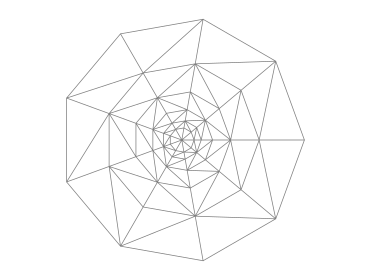
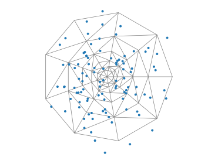
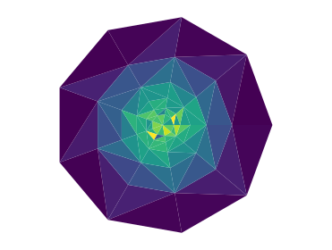

# trihistogram

Make two-dimensional histogram on irregular trianglar grids.

## Simple example

We first build a triangular grid:

```python
from pylab import *
import matplotlib.tri as tri

theta = linspace(0,1,10)[:-1]*2*pi
r = logspace( -1, 0, 6 )

theta, r = meshgrid(theta, r)
theta = theta.flatten()
r = r.flatten()

T = tri.Triangulation( [0] + list( r*cos(theta) ), [0] + list( r*sin(theta) ) ) 
triplot( T, lw = .75, color = 'grey' )
```

Here is the result:



We then produce random data, an plot some of it:

```python
from numpy.random import normal

x, y = normal( scale = .4, size = (2,10000) )

step = 100
plot( x[::step], y[::step], '.' )
```

Here is the result:



We can now compute our histogram:

```python
H = th.trihistogram2d( T, x, y )
print(H)
```

```console
>>> [ 25  28  41  29  29  32  32  32  44 134 129 130 135 170 130 189 158 150
 131 123 140 167 131 156 201 196 147 159 145 153 145 128 153 211 161 174
 143 133 122 168 155 187 161  37  62  69  33  75 144 156 205  93 124 162
 218 147  89 133  76 149  70 139  95 155  96  68  48 138  86  64  51  37
  12  57  56  35  13  22  19  21  28  60  42  30  16  38  67  34  16  29
  21  53  44  22  14  59  48  26  12]
```

This is the number of data point in each triangle. Points outside of the triangulation are discarded. To produce a normed histogram:

```python
H = th.trihistogram2d( T, x, y, dist = True )
tripcolor( T, H )
```

Here is the result:


